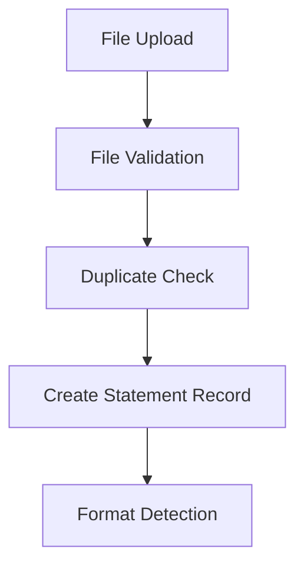
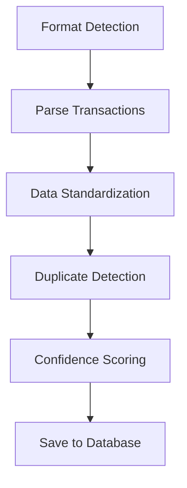
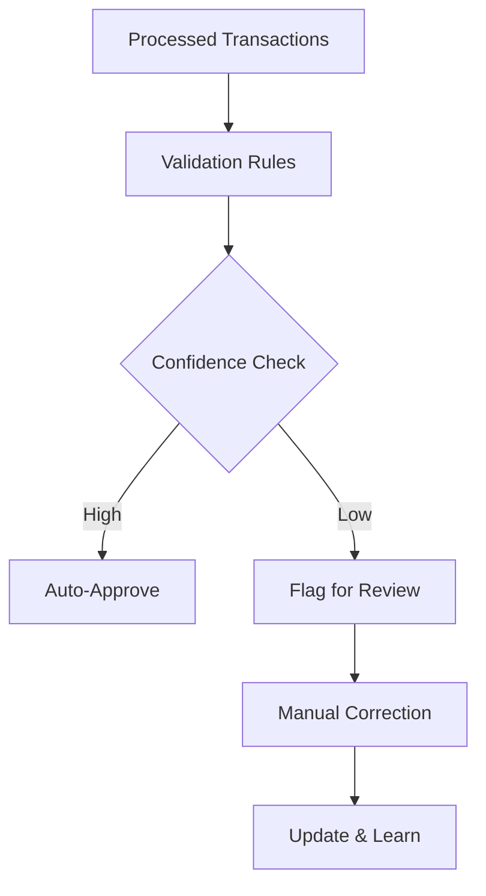

# Bank Statement Processing System

## Overview

The Bank Statement Processing System is a comprehensive solution for uploading, parsing, and managing bank statements from major international financial institutions. The system supports multiple file formats (CSV, Excel, PDF) and automatically extracts transaction data with intelligent duplicate detection and validation.

## Features

### Core Functionality
- **Multi-Format Support**: CSV, Excel (.xlsx, .xls), and PDF bank statements
- **International Bank Support**: Pre-configured parsers for Chase, Bank of America, HSBC, Wells Fargo, Citibank, and generic formats
- **Automatic Format Detection**: Smart detection of bank formats based on file structure and headers
- **Intelligent Parsing**: Robust data extraction with confidence scoring and error handling
- **Duplicate Detection**: Hash-based duplicate detection with configurable thresholds
- **Transaction Standardization**: Consistent data format across different bank statement types

### Advanced Features
- **Manual Correction Interface**: User-friendly correction tools with audit logging
- **Real-time Processing**: Immediate processing with progress tracking
- **Batch Processing**: Efficient handling of multiple statements
- **Analytics Dashboard**: Comprehensive statistics and insights
- **Integration Ready**: Seamless integration with existing expense management workflow

## Architecture

### Backend Components

#### 1. BankStatementProcessor (`src/services/bankStatementProcessor.js`)
Main processing engine that handles:
- File validation and format detection
- Bank-specific parsing logic
- Transaction extraction and standardization
- Duplicate detection algorithms
- Summary calculation and statistics

#### 2. Bank Statement Routes (`src/routes/bankStatements.js`)
RESTful API endpoints for:
- File upload and processing
- Statement management (CRUD operations)
- Transaction querying and updates
- Analytics and reporting
- Format configuration

#### 3. Database Models
Prisma-based models for:
- `BankStatement`: Statement metadata and processing status
- `BankTransaction`: Individual transaction records
- `StatementCorrection`: Audit log for manual corrections
- `TransactionCorrection`: Transaction-level correction history
- `BankFormat`: Bank-specific parsing configurations

### Frontend Components

#### 1. StatementUpload (`frontend/src/components/bankStatements/StatementUpload.tsx`)
Interactive upload component featuring:
- Drag-and-drop file upload
- Real-time validation
- Processing progress tracking
- Configuration options for account details

#### 2. StatementList (`frontend/src/components/bankStatements/StatementList.tsx`)
Management interface providing:
- Statement listing with filtering
- Status tracking and error handling
- Bulk operations
- Pagination and search

#### 3. Bank Statement Service (`frontend/src/services/bankStatementService.ts`)
TypeScript service layer for:
- API communication
- Data type definitions
- Utility functions
- Error handling

## Supported Bank Formats

### Major US Banks

#### Chase Bank
- **Format**: CSV
- **Key Fields**: Transaction Date, Description, Amount, Type, Balance
- **Date Format**: MM/DD/YYYY
- **Currency**: USD

#### Bank of America
- **Format**: CSV
- **Key Fields**: Posted Date, Payee, Amount, Running Balance
- **Date Format**: MM/DD/YYYY
- **Currency**: USD

#### Wells Fargo
- **Format**: CSV
- **Key Fields**: Date, Amount, Description, Memo
- **Date Format**: MM/DD/YYYY
- **Currency**: USD

#### Citibank
- **Format**: CSV
- **Key Fields**: Date, Description, Debit, Credit, Running Balance
- **Date Format**: MM/DD/YYYY
- **Currency**: USD

### International Banks

#### HSBC
- **Format**: CSV
- **Key Fields**: Date, Description, Amount, Balance
- **Date Format**: DD/MM/YYYY or YYYY-MM-DD
- **Currency**: GBP, USD, EUR (multi-currency support)

### Generic Formats
- **Excel (.xlsx/.xls)**: Flexible column mapping
- **PDF**: OCR-based extraction (basic support)

## Installation and Setup

### Prerequisites
```bash
# Core dependencies
npm install xlsx csv-parser csv-parse fast-csv papaparse
npm install moment date-fns validator lodash
npm install pdf-parse pdfjs-dist tabula-js
npm install excel4node crypto
```

### Database Migration
```bash
# Generate Prisma client with new models
npx prisma generate

# Push schema changes to database
npx prisma db push

# Optional: Reset database with new schema
npx prisma migrate reset --force
```

### Environment Configuration
Add to your `.env` file:
```bash
# Bank Statement Processing Settings
BANK_STATEMENT_MAX_FILE_SIZE=52428800
BANK_STATEMENT_ALLOWED_TYPES=csv,xlsx,xls,pdf
BANK_STATEMENT_UPLOAD_DIR=uploads/bank-statements
BANK_STATEMENT_BATCH_SIZE=100
BANK_STATEMENT_DEFAULT_CURRENCY=USD
BANK_STATEMENT_AUTO_PROCESS_ENABLED=true
```

## API Reference

### Upload Bank Statement
```http
POST /api/v1/bank-statements/upload
Content-Type: multipart/form-data

# Parameters:
# - statement (file): Bank statement file
# - accountNumber (string, optional): Account number
# - accountName (string, optional): Account name
# - currency (string, optional): Currency code (default: USD)
# - bankFormat (string, optional): Force specific bank format
# - autoProcess (boolean, optional): Process immediately (default: true)
```

### Get Statements
```http
GET /api/v1/bank-statements?page=1&limit=20&status=PROCESSED

# Query Parameters:
# - page: Page number (default: 1)
# - limit: Items per page (default: 20)
# - status: Filter by status
# - accountNumber: Filter by account
# - bankName: Filter by bank
# - startDate: Filter by date range
# - endDate: Filter by date range
```

### Get Statement Details
```http
GET /api/v1/bank-statements/{id}?includeTransactions=true

# Query Parameters:
# - includeTransactions: Include transaction data
# - transactionPage: Transaction page number
# - transactionLimit: Transactions per page
```

### Update Transaction
```http
PUT /api/v1/bank-statements/transactions/{transactionId}
Content-Type: application/json

{
  "description": "Updated description",
  "amount": 123.45,
  "type": "DEBIT",
  "merchant": "Merchant Name",
  "category": "office_supplies",
  "correctionReason": "Manual correction"
}
```

### Get Analytics
```http
GET /api/v1/bank-statements/analytics/summary?days=30

# Query Parameters:
# - days: Analysis period (default: 30)
# - accountNumber: Filter by account
```

## File Format Specifications

### CSV Format Requirements
- **Encoding**: UTF-8 recommended
- **Delimiter**: Comma (,) or auto-detected
- **Headers**: First row should contain column names
- **Date Formats**: MM/DD/YYYY, DD/MM/YYYY, YYYY-MM-DD
- **Amount Formats**: Decimal numbers, optional currency symbols
- **Required Fields**: Date, Description, Amount

### Excel Format Requirements
- **File Types**: .xlsx, .xls
- **Sheet**: First sheet used by default
- **Headers**: First row should contain column names
- **Data Types**: Proper date and number formatting
- **Size Limit**: 50MB maximum

### PDF Format Support
- **Text-based PDFs**: Direct text extraction
- **Scanned PDFs**: OCR processing (limited accuracy)
- **Table Detection**: Automatic table structure recognition
- **Manual Review**: May require manual verification

## Processing Workflow

### 1. File Upload


### 2. Data Processing


### 3. Quality Assurance


## Error Handling

### Common Issues and Solutions

#### File Format Not Recognized
- **Cause**: Unsupported format or corrupted file
- **Solution**: Check file type and format requirements
- **Prevention**: Use file validation before upload

#### Parsing Errors
- **Cause**: Non-standard bank format or data corruption
- **Solution**: Use manual correction interface
- **Prevention**: Regular format updates and validation

#### Duplicate Detection False Positives
- **Cause**: Similar transactions from different time periods
- **Solution**: Adjust duplicate detection thresholds
- **Configuration**: `BANK_STATEMENT_DUPLICATE_THRESHOLD`

#### Low Parse Confidence
- **Cause**: Poor file quality or non-standard format
- **Solution**: Manual review and correction
- **Improvement**: Add new bank format configurations

## Performance Optimization

### Processing Performance
- **Batch Size**: Adjust `BANK_STATEMENT_BATCH_SIZE` based on system resources
- **Concurrent Processing**: Limit concurrent jobs with `BANK_STATEMENT_MAX_CONCURRENT_PROCESSING`
- **Memory Management**: Large files are processed in chunks

### Database Optimization
- **Indexing**: Automatic indexes on frequently queried fields
- **Pagination**: Efficient pagination for large datasets
- **Archiving**: Move old statements to archive status

### File Storage
- **Upload Directory**: Configure dedicated storage path
- **Cleanup**: Automatic cleanup of temporary processing files
- **Compression**: Optional file compression for storage efficiency

## Security Considerations

### Data Protection
- **File Validation**: Strict file type and size validation
- **SQL Injection**: Parameterized queries and Prisma ORM protection
- **Access Control**: Company-level data isolation
- **Audit Logging**: Complete audit trail for all corrections

### Privacy Compliance
- **Data Retention**: Configurable retention policies
- **Anonymization**: Option to anonymize sensitive data
- **Export Controls**: Secure data export capabilities
- **GDPR Compliance**: Right to deletion and data portability

## Monitoring and Analytics

### Processing Metrics
- **Success Rate**: Percentage of successfully processed statements
- **Processing Time**: Average time per statement
- **Error Rates**: Categorized error statistics
- **Duplicate Detection**: Accuracy and false positive rates

### Business Metrics
- **Transaction Volume**: Total transactions processed
- **Amount Analysis**: Transaction amount patterns
- **Bank Coverage**: Usage across different banks
- **User Adoption**: Upload and correction activity

## Troubleshooting

### Common Issues

#### Statement Not Processing
1. Check file format compatibility
2. Verify file size limits
3. Review processing logs
4. Check system resources

#### Incorrect Transaction Data
1. Review bank format configuration
2. Check field mappings
3. Validate date and amount formats
4. Use manual correction interface

#### Performance Issues
1. Monitor system resources
2. Adjust batch sizes
3. Check database performance
4. Review concurrent processing limits

### Debug Mode
Enable detailed logging by setting:
```bash
LOG_LEVEL=debug
```

### Support Contacts
- **Technical Issues**: Check application logs and error messages
- **Bank Format Requests**: Submit format specifications
- **Feature Requests**: Use the issue tracking system

## Future Enhancements

### Planned Features
- **Machine Learning**: Auto-categorization of transactions
- **Expense Matching**: Automatic matching with existing expenses
- **Workflow Integration**: Approval workflows for corrections
- **Advanced Analytics**: Predictive insights and reporting

### API Improvements
- **Webhooks**: Real-time processing notifications
- **Bulk Operations**: Enhanced bulk processing capabilities
- **GraphQL**: Alternative query interface
- **Rate Limiting**: Enhanced API protection

### Integration Opportunities
- **Accounting Systems**: QuickBooks, Xero integration
- **Banking APIs**: Direct bank connection support
- **OCR Services**: Enhanced PDF processing
- **ML Services**: Advanced categorization models

## Version History

### v1.0.0 (Current)
- Initial release with core processing functionality
- Support for major US and international banks
- Basic duplicate detection and validation
- Manual correction interface
- Analytics dashboard

### Planned v1.1.0
- Enhanced ML categorization integration
- Expense matching capabilities
- Advanced duplicate detection
- Improved PDF processing
- Additional bank format support 